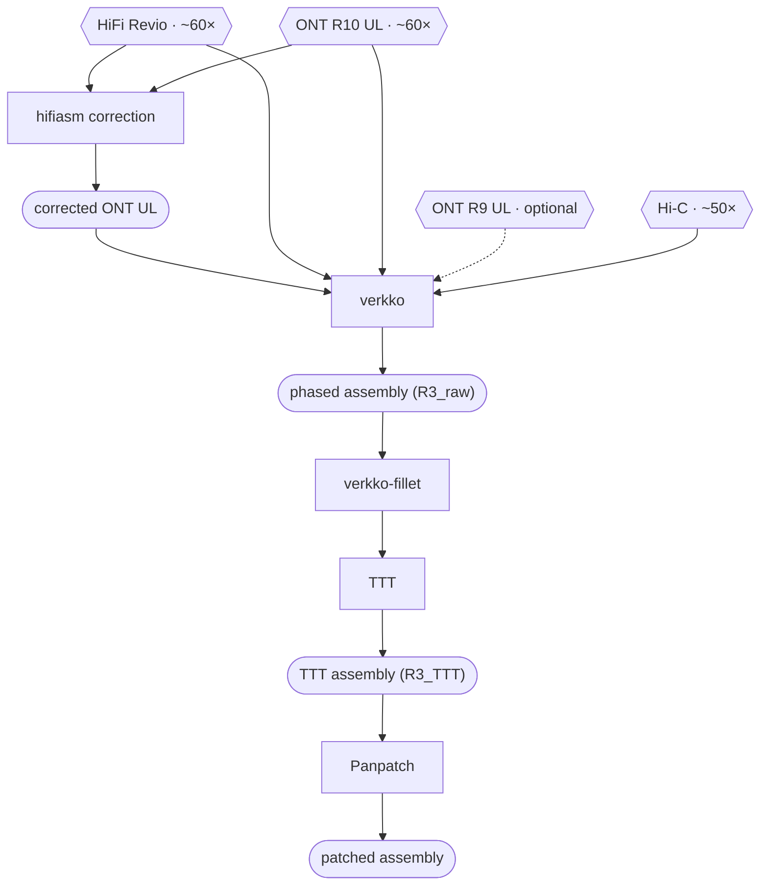

# HPRC Assembly Workflow

Benchmarking using HG002 v1.1 and GQC · extended with HPRC production QC, TTT, and Panpatch

## Overview

The pipeline has two assembly stages. ONT UL reads are first error-corrected by hifiasm using HiFi reads as a guide, then the corrected ONT UL, raw HiFi, raw ONT UL, and Hi-C data are co-assembled with verkko. The result is validated against the HG002 v1.1 benchmark using GQC, then processed through the full HPRC QC suite. Optional TTT (Trivial Tangle Traverser) gap-filling resolves complex assembly graph tangles to produce the TTT assemblies, which can be further refined with Panpatch.

Input coverage follows the HPRC recipe: roughly 60× HiFi, 60× ONT UL over 100 kbp, and 50× Hi-C.

## Requirements

| Tool | Version | Used in |
|------|---------|---------|
| hifiasm | v0.25.0r910+, [`hybrid_v1` branch](https://github.com/chhylp123/hifiasm/tree/f5078f7b23fa3ba546189255d0242756c25619ca) | Stage 3 |
| verkko | v2.3+ | Stage 4 |
| python | 3.8+ | Stage 4 |
| winnowmap, mashmap | mashmap 3+ | Stage 4 |
| bwa, samtools, seqtk | current | Stages 3 and 4 |
| htslib (`bgzip`) | current | Stage 3 |
| GQC | current | QC · Benchmark |
| minimap2 | current | Stage 6 |

**Resource footprint on our cluster:**

| Stage | RAM | Compute |
|-------|-----|---------|
| hifiasm correction | under 800 GB | ~3,000 CPU h |
| verkko assembly | under 300 GB | ~13,000 CPU h, 41 h walltime |

Plan for several TB of working space. The verkko intermediate directory is the bulk of it and is not cleaned up automatically.
