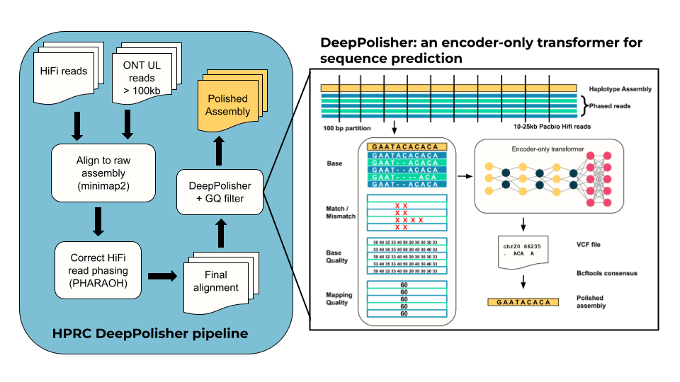

# Polishing

Assemblies are polished using a custom pipeline based around [DeepPolisher](https://github.com/google/deeppolisher).

## Pipeline steps

1. **Alignment** — all HiFi reads aligned to the diploid assembly using minimap2
2. **ONT UL alignment** — reads >100 kb aligned separately to each haplotype using minimap2
3. **[PHARAOH](https://github.com/miramastoras/PHARAOH)** — ensures optimal HiFi read phasing by leveraging ONT UL information to assign reads to the correct haplotype in stretches of homozygosity >20 kb
4. **[DeepPolisher](https://github.com/google/deeppolisher)** — encoder-only transformer model run on PHARAOH-corrected HiFi alignments to predict polishing edits

WDL source: [`polishing/wdl/workflows/hprc_DeepPolisher.wdl`](https://github.com/human-pangenomics/hpp_production_workflows/tree/v3/polishing/wdl/workflows/hprc_DeepPolisher.wdl)
