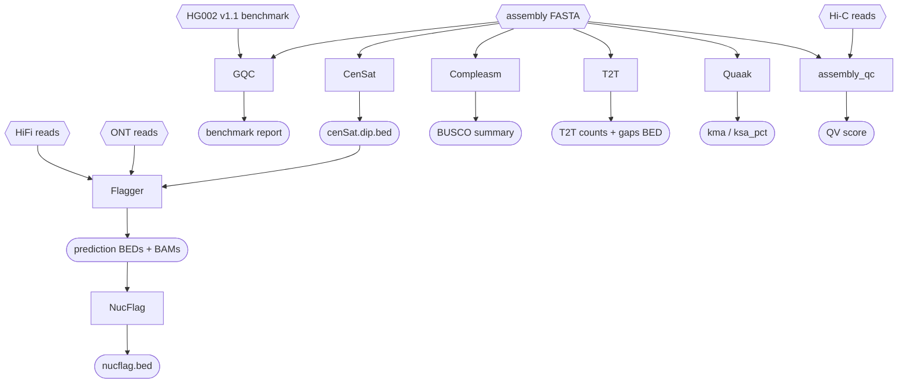

# QC Pipeline

The QC pipeline is a standalone suite that can be applied to any assembly. Run it after verkko (Assembly 4), after TTT (Assembly 7), after Panpatch (Assembly 8), or any combination. For R3 we ran it after verkko and again after TTT.

**CenSat must complete before Flagger can start.** All other tools run in parallel with CenSat.

## Tool summary

| Step | Tool | Input | Key output | Depends on |
|------|------|-------|-----------|------------|
| QC 1 | GQC | assembly + HG002 v1.1 benchmark | benchmark report | — |
| QC 2 | CenSat | assembly FASTA | `cenSat.dip.bed` | — |
| QC 3 | Compleasm | assembly FASTA | BUSCO summary | — |
| QC 4 | T2T | assembly FASTA | T2T counts, gaps BED | — |
| QC 5 | Quaak | assembly FASTA | kma / ksa_pct | — |
| QC 6 | assembly_qc / Yak QV | assembly + Hi-C reads | QV score | — |
| QC 7 | Flagger | assembly + HiFi + ONT + CenSat BED | prediction BEDs + BAMs | CenSat |
| QC 8 | NucFlag | Flagger BAMs | nucflag.bed | Flagger |
